# Hackathon Team Fusion Optics

## Intelligent Data Schema Inference & Modeling Platform

An innovative solution that uses Large Language Models (LLMs) to automatically detect files, infer schemas, generate vector embeddings, and match schemas. The platform outputs dbt SQL models enriched with metadata, stores them in a data warehouse, and makes them queryable via BI tools or a chat interface.

## 🔍 Problem Statement

Data engineers and analysts spend significant time:
- Understanding new datasets
- Creating normalized database schemas
- Writing transformation logic
- Maintaining consistency across similar data models

Our solution automates this process using AI, significantly reducing time-to-insight for new datasets.

## 🏗️ Architecture

### High-Level Architecture (POC)

Our proof-of-concept demonstrates a streamlined architecture:
- **Input Layer**: Processes raw data files
- **Intelligence Layer**: Uses ChromaDB and LLMs for vector storage and schema inference
- **Storage Layer**: Stores raw data in ClickHouse
- **Transformation Layer**: Generates and runs dbt models
- **Analytics Layer**: Makes transformed data available for analysis

### Detailed Flow Diagram

```mermaid
%%{init: {"theme": "default"}}%%

graph LR
  %% Blackboard Chalk Style (Black & White)

  %% === Layers & Components ===
  subgraph INGESTION ["🟦 Ingestion Layer"]
    direction TB
    A1["📂 External Data (CSV, APIs, DBs)"]
    A2["🔌 Airbyte (Extract & Load)"]
    A3["🪣 MinIO (Raw Data Lake)"]
  end

  subgraph ORCHESTRATION ["🟪 Orchestration Layer"]
    F1["🐍 Apache Airflow (Central Orchestrator)"]
  end

  subgraph PROCESSING ["🟩 Processing & LLM Layer"]
    B1["⚡ MinIO Event Notification (New File)"]
    B2["📄 Extract Schema & Sample Rows (DuckDB/PyArrow)"]
    B3["🤖 Generate Embeddings (Sentence Transformers)"]
    B4["🔍 Vector DB Query (Weaviate/Qdrant)"]
    B5["✍️ Compose LLM Prompt with Context"]
    B6["🧠 LLM Harmonizes Schema"]
    B7["💾 Store Schema + Embeddings in Vector DB"]
  end

  subgraph VECTORDB ["🗄️ Vector DB"]
    V1["Weaviate / Qdrant / Chroma"]
  end

  subgraph MODELING ["🟧 dbt Modeling Layer"]
    C1["🛠️ Generate SQL Model from Harmonized Schema"]
    C2["📂 Commit & Push Model to Git Repo"]
    C3["▶️ Run dbt (run/test/docs)"]
    C4["🐘 Modeled Tables in PostgreSQL"]
  end

  subgraph METADATA ["🟨 Governance & Metadata Layer"]
    D1["📚 OpenMetadata"]
    D2["📥 Metadata Ingestion (dbt & Postgres)"]
    D3["🧬 Lineage, Access Control, Alerts"]
  end

  subgraph USER ["🟫 User Interaction Layer"]
    U1["👩‍💻 Data Engineers & Analysts"]
    U2["📖 dbt Docs UI"]
    U3["📊 BI Tools (Metabase, Superset)"]
    U4["💬 LLM Chat Interface (Semantic Search + Metadata)"]
  end

  %% === Link Explanations ===

  %% Ingestion Links
  A1 -->|Data Extraction| A2
  A2 -->|Raw Data Sync| A3

  %% Airflow triggers Airbyte
  F1 -->|Trigger Airbyte Sync via API| A2

  %% MinIO notifies Airflow on new files
  A3 -->|Event Notification| B1
  B1 -->|Trigger Embedding Workflow| F1

  %% Airflow runs embedding & schema extraction tasks
  F1 -->|Run schema extraction task| B2
  B2 -->|Pass schema samples| B3
  B3 -->|Generate vector embeddings| V1
  B3 -->|Send embeddings data| B4
  B4 -->|Query similar schema embeddings| V1
  B4 -->|Return similar schemas| B5

  %% Compose prompt for LLM harmonization
  B5 -->|Prompt with context| B6
  B6 -->|Output harmonized schema| B7
  B7 -->|Store updated schema & embeddings| V1

  %% Airflow generates dbt model from harmonized schema
  B6 -->|Schema → SQL model| C1
  C1 -->|Save model files| C2

  %% Airflow triggers dbt run, test, docs
  F1 -->|Run dbt CLI| C3
  C2 -->|Trigger dbt run| C3
  C3 -->|Load tables| C4

  %% Metadata ingestion and governance
  C2 -->|Push model metadata| D2
  C4 -->|Push table metadata| D2
  D2 -->|Ingest into OpenMetadata| D1
  D1 -->|Enable lineage, access control| D3

  %% User interaction links
  U1 -->|Consume metadata & docs| U2
  U1 -->|Access data warehouse| U3
  U1 -->|Manage & monitor pipelines| F1
  D1 -->|Serve metadata| U4
  V1 -->|Serve vector search| U4
  B5 -->|LLM prompt data| U4
```

The full architecture includes:
- **Ingestion Layer**: MinIO for raw data storage
- **Orchestration Layer**: Apache Airflow for workflow management
- **Processing & LLM Layer**: For schema extraction and vector embedding generation
- **Vector DB**: Stores schema embeddings for similarity matching
- **dbt Modeling Layer**: Generates data models in PostgreSQL
- **Governance & Metadata Layer**: Tracks lineage and access control
- **User Interaction Layer**: Provides LLM chat interface for semantic search

## ✨ Key Features

- **Automatic Schema Inference**: Uses LLMs to understand dataset structure and semantics
- **Domain Classification**: Identifies the data domain (finance, healthcare, etc.)
- **Vector Similarity**: Finds similar datasets to improve schema design
- **dbt Model Generation**: Creates production-ready SQL transformation code
- **Metadata Enrichment**: Adds descriptions and documentation automatically
- **Semantic Search**: Allows natural language queries against the data catalog

## 🚀 Technology Stack

- **Vector Databases**: ChromaDB/Weaviate/Qdrant
- **Data Warehouse**: ClickHouse/PostgreSQL
- **LLM Integration**: Hugging Face models
- **Embeddings**: SentenceTransformer
- **Data Transformation**: dbt (data build tool)
- **Orchestration**: Apache Airflow
- **Storage**: MinIO (S3-compatible)
- **Programming**: Python

## 🔮 Future Enhancements

- **Data Quality**: Automatic detection of data quality issues
- **Schema Evolution**: Tracking and managing schema changes over time
- **Multi-Database Support**: Extending beyond ClickHouse to other database engines
- **Advanced Lineage**: Deeper integration with data governance tools
- **UI Dashboard**: Web interface for monitoring and management

## 📜 License

This project is licensed under the MIT License - see the LICENSE file for details.

---
